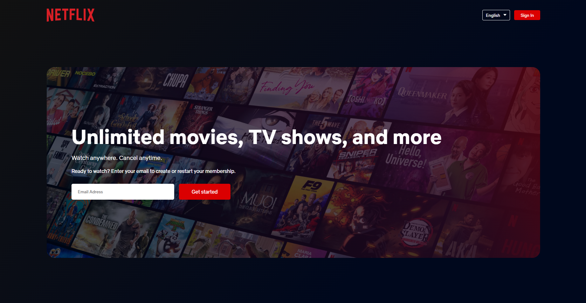

# 🖊️ Netflix Clone Project
This is a small project I worked on to gain more abilities on my path to becoming a web developer.

My name is Manuel Corpas, and currently I'm studying web development. As a beginner, I wanted to start a small project to put my abilities to the test, which is why I chose to clone the Netflix website.

With this project, I learned a bit more about positioning with Flexbox and how to lay it out as I wanted.

This project is nearly in a perfect state, but as I said before, I'm still learning, so I will update it once I gain more knowledge.

## 📸 Screenshots

## 💬 Feedback

If you have any feedback, please reach out to me at info@manuelck.com or 
[DM On Twitter](https://twitter.com/manuelck_)
